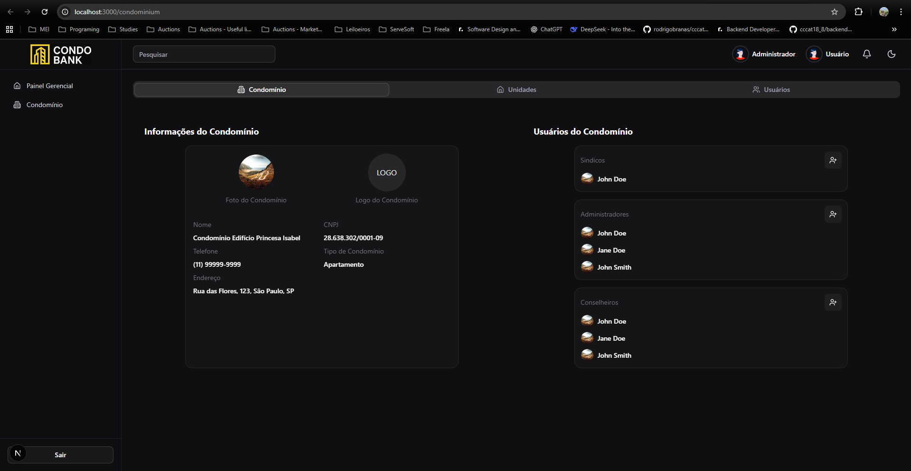

# CondoPay Layout

Um projeto de layout moderno construído com Next.js, React, TypeScript, Tailwind CSS e Shadcn UI para o sistema CondoPay.

## 🌐 Demonstração

**Site em produção:** [https://condopay-layout.vercel.app/condominium](https://condopay-layout.vercel.app/condominium)



## 🛠️ Stack Tecnológica

- **Next.js 15.4.6** - Framework React com App Router
- **React 19.1.0** - Biblioteca para interfaces de usuário
- **TypeScript 5** - Tipagem estática para JavaScript
- **Tailwind CSS 4** - Framework CSS utilitário
- **Shadcn UI** - Componentes de UI reutilizáveis
- **Lucide React** - Ícones modernos
- **ESLint & Prettier** - Linting e formatação de código

## 📁 Estrutura do Projeto

```
src/
├── app/                 # App Router (Next.js 13+)
├── components/
│   ├── ui/             # Componentes Shadcn UI
│   └── common/         # Componentes compartilhados
├── lib/                # Utilitários e helpers
└── hooks/              # Custom React hooks
```

## 🚀 Setup do Projeto

### Pré-requisitos

- Node.js 18+
- npm, yarn, pnpm ou bun

### Instalação

1. Clone o repositório:

```bash
git clone <repository-url>
cd condopay-layout
```

2. Instale as dependências:

```bash
npm install
# ou
yarn install
# ou
pnpm install
# ou
bun install
```

3. Execute o servidor de desenvolvimento:

```bash
npm run dev
# ou
yarn dev
# ou
pnpm dev
# ou
bun dev
```

4. Abra [http://localhost:3000](http://localhost:3000) no seu navegador para ver o resultado.

### Scripts Disponíveis

- `npm run dev` - Inicia o servidor de desenvolvimento
- `npm run build` - Gera a build de produção
- `npm run start` - Inicia o servidor de produção
- `npm run lint` - Executa o linting do código

## 📝 Conventional Commits

Este projeto segue o padrão [Conventional Commits](https://www.conventionalcommits.org/) para padronização das mensagens de commit.

### Formato

```
<tipo>[escopo opcional]: <descrição>

[corpo opcional]

[rodapé opcional]
```

### Tipos de Commit

- **feat**: Nova funcionalidade
- **fix**: Correção de bug
- **docs**: Alterações na documentação
- **style**: Formatação, ponto e vírgula, etc (sem mudança de código)
- **refactor**: Refatoração de código (sem nova funcionalidade ou correção)
- **perf**: Melhoria de performance
- **test**: Adição ou correção de testes
- **chore**: Alterações em ferramentas, configurações, dependências
- **ci**: Alterações em arquivos de CI/CD
- **build**: Alterações no sistema de build

### Exemplos

```bash
# Nova funcionalidade
git commit -m "feat(auth): adicionar autenticação de usuário"

# Correção de bug
git commit -m "fix(header): corrigir alinhamento do menu mobile"

# Documentação
git commit -m "docs: atualizar README com instruções de setup"

# Estilo/formatação
git commit -m "style(components): aplicar formatação prettier"

# Refatoração
git commit -m "refactor(utils): extrair função de formatação de data"

# Configuração
git commit -m "chore: atualizar dependências do projeto"
```

### Breaking Changes

Para mudanças que quebram compatibilidade, adicione `!` após o tipo:

```bash
git commit -m "feat!: alterar estrutura da API de autenticação"
```

## 🔧 Desenvolvimento

### Configuração do Editor

O projeto inclui configurações para:

- **ESLint**: Linting de código
- **Prettier**: Formatação automática
- **TypeScript**: Verificação de tipos

### Componentes UI

Utilizamos o **Shadcn UI** com configuração personalizada:

- Estilo: New York
- CSS Variables: Habilitado
- Cor base: Neutral
- Ícones: Lucide React

Para adicionar novos componentes:

```bash
npx shadcn@latest add <component-name>
```

## 📚 Recursos

- [Next.js Documentation](https://nextjs.org/docs) - Documentação oficial do Next.js
- [Tailwind CSS](https://tailwindcss.com/docs) - Documentação do Tailwind
- [Shadcn UI](https://ui.shadcn.com) - Componentes UI
- [Lucide Icons](https://lucide.dev) - Biblioteca de ícones
- [Conventional Commits](https://www.conventionalcommits.org/) - Padrão de commits
